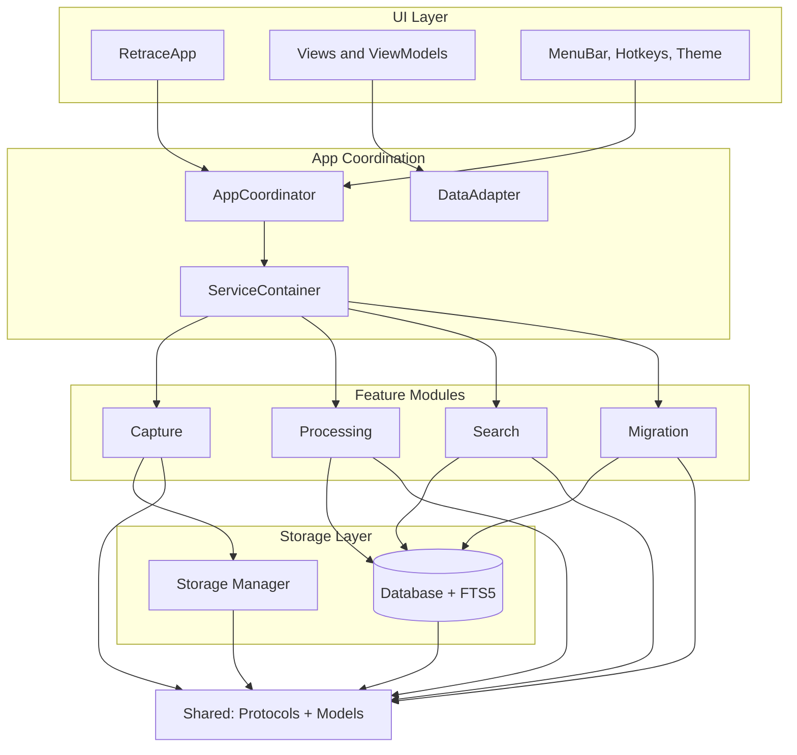
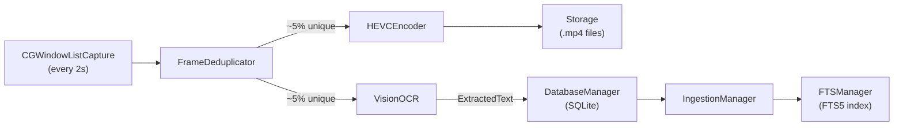
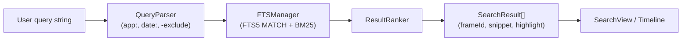
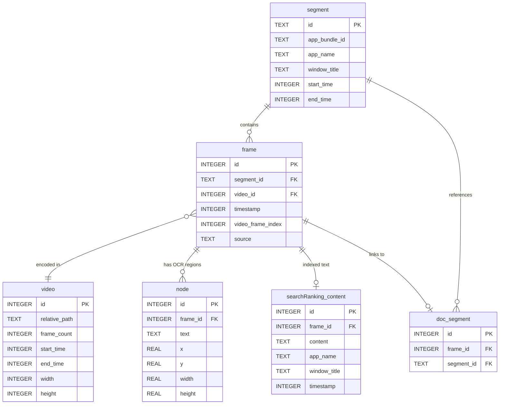
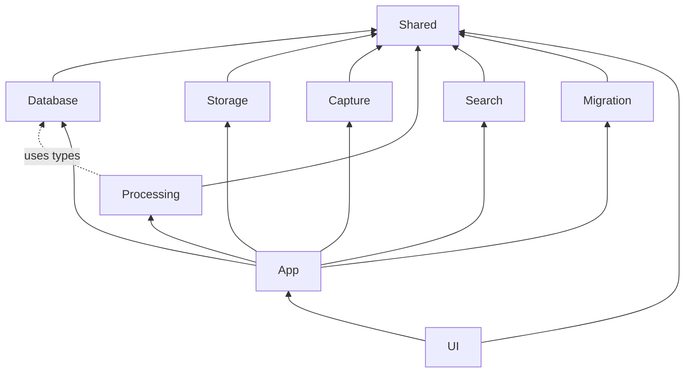
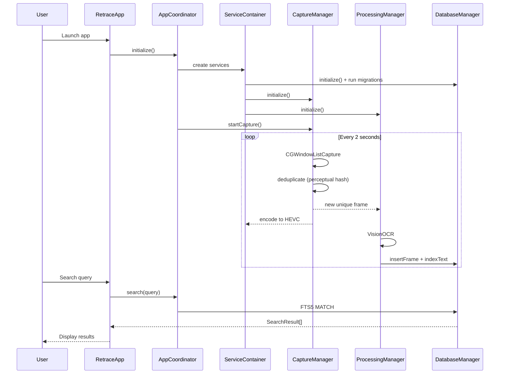
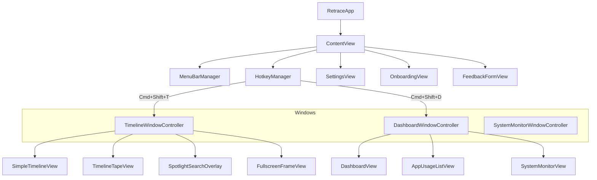
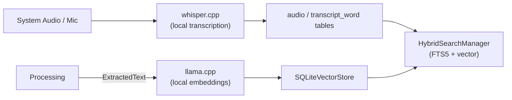

# Diagrams

Visual diagrams of Retrace's architecture, data flow, database schema, and module dependencies. All diagrams use [Mermaid](https://mermaid.js.org/) syntax and render natively on GitHub.

---

## High-Level Architecture



---

## Capture and Processing Data Flow



---

## Search Pipeline



---

## Database Entity Relationship



---

## Module Dependency Graph

All modules depend only on `Shared` (protocols and models). The `App` layer composes them. No module imports another module directly.



Note: Processing has a build-time dependency on Database (for `DatabaseManager` type), but communicates via `DatabaseProtocol` at runtime.

---

## Application Lifecycle



---

## Storage Layout

```
~/Library/Application Support/Retrace/
  retrace.db              # SQLite database (FTS5, WAL mode)
  retrace.db-wal          # Write-ahead log
  retrace.db-shm          # Shared memory
  videos/
    2026/
      01/
        segment_abc123.mp4   # HEVC encoded screen recordings
        segment_def456.mp4
      02/
        ...
```

---

## UI Structure



---

## Future: Audio and Vector Search (Release 2)



These components are bundled in `Vendors/` but currently disabled.
