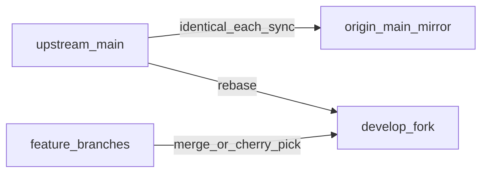

# Fork workflow: upstream, local builds, and optional GitButler

This fork tracks [haseab/retrace](https://github.com/haseab/retrace) while keeping unpublished work on **`develop`** until you open a PR upstream. On GitHub, set the fork’s **default branch** to **`develop`** so new clones and PRs target your working branch (Settings → General → Default branch, or `gh repo edit <you>/retrace --default-branch develop`).

## Remotes

| Remote | URL | Role |
|--------|-----|------|
| `origin` | `https://github.com/aculich/retrace.git` | Your fork (push here) |
| `upstream` | `https://github.com/haseab/retrace.git` | Canonical upstream |

If `upstream` is missing:

```sh
git remote add upstream https://github.com/haseab/retrace.git
```

## Branch roles

- **`develop`** — Default branch for **your** work on the fork: rebased onto `upstream/main` regularly, plus fork-only commits. Open PRs upstream from here (or from short-lived feature branches). **Do not treat `origin/main` as your integration branch** — use `develop`.

- **`main` (on your fork)** — **Mirror of `upstream/main` only.** Every `./sync` runs `git push origin upstream/main:main --force-with-lease` so `origin/main` stays identical to upstream (no long-lived fork-only commits on `main`). Your unique work stays on `develop`.

  To mirror **without** a full `./sync` (e.g. CI or another machine):

  ```sh
  git fetch upstream
  git push origin upstream/main:main --force-with-lease
  ```

## Tag vs `main`

Release tags (e.g. [v0.8.7](https://github.com/haseab/retrace/releases/tag/v0.8.7)) point at a snapshot commit. **`upstream/main` can be newer than the latest tag.** For “bleeding edge” upstream, always rebase onto `upstream/main`, not onto a tag.

## Daily loop: sync and run

From the repo root (`retrace__haseab/`):

| Command | What it does |
|---------|----------------|
| **`./sync`** | `git fetch upstream`, **mirror `upstream/main` → `origin/main`**, `checkout develop`, **`git rebase upstream/main`**, then **`./build_and_sign.sh`**. Installs to `/Applications/Retrace.app`. **Does not delete app data or settings.** |
| **`./dev.sh`** | `swift build -c debug` and runs **`.build/debug/Retrace`** with build metadata env vars. Use for fast iteration; not the same as the signed app in `/Applications/`. |
| **`./go`** | Safe by default: quit app, build, install (same idea as a quick reinstall). **`./go --full-reset`** wipes data, preferences, and resets TCC — requires typing `yes` to confirm. |

After `./sync` or `./build_and_sign.sh`:

```sh
open /Applications/Retrace.app
```

## Upstream PRs and other branches

**`./sync` does not merge feature branches into `develop`.** Bring work in explicitly:

```sh
git checkout develop
git merge feature/your-branch    # or: git cherry-pick <sha>
```

To try an open PR from upstream without merging the branch locally:

```sh
git fetch upstream pull/<PR_NUMBER>/head:pr-<PR_NUMBER>
git checkout develop
git merge pr-<PR_NUMBER>           # or cherry-pick specific commits
```

## Verification after integrating upstream

Minimum (from repo root):

```sh
swift build
swift test                       # can be slow; see AGENTS.md for filters
./build_and_sign.sh              # or ./sync for full fork sync + install
```

Smoke: launch the app, confirm capture/search still behave, and check Settings after large merges.

## Data and backups

- Local data layout: [docs/RETRACE_DATA_LAYOUT.md](docs/RETRACE_DATA_LAYOUT.md).
- Small backup (DB + prefs, **excludes** large `chunks/`): `./scripts/backup_retrace_data.sh` (optional: `--include-logs`).
- Do not use **`./go --full-reset`** unless you intend a full wipe.

## GitButler and `but` (optional)

Same constraints as other projects using stacked branches:

1. Install the app + CLI: `brew install --cask gitbutler` (CLI binary: `but`).
2. **Do not mix Graphite (`gt`) and GitButler** stacking in the same worktree; pick one model per repo.
3. Retrace does not require “integration wave” branches unless you choose that complexity; `./sync` + `develop` is enough for most fork workflows.

## Push after rebase

Rebasing rewrites history. After `./sync`, update the remote with:

```sh
git push origin develop --force-with-lease
```

## Publishing pull requests upstream

Target repository: **[haseab/retrace](https://github.com/haseab/retrace)** (`upstream`), base branch: **`main`**. Your fork (**`origin`**) is where GitHub reads the head branch from.

Upstream expectations for titles, description, and review bar are in [CONTRIBUTING.md](CONTRIBUTING.md) (**Pull Request Process**). Treat the following as a fork-specific add-on.

### 1. Prepare the change set

1. **Sync** so your work sits on current upstream:

   ```sh
   ./sync
   git push origin develop --force-with-lease
   ```

2. **Verify** (adjust scope if the change is narrow):

   ```sh
   swift build
   swift test   # optional filters; see AGENTS.md
   ```

3. **Prefer one topic per PR.** If `develop` mixes unrelated changes, create a **dedicated branch** from `upstream/main` and bring in only the commits you want (cherry-pick or copy commits), then open the PR from that branch — not from a noisy `develop`.

   ```sh
   git fetch upstream
   git checkout -b fix/short-description upstream/main
   git cherry-pick <sha1> <sha2>   # or: git merge --no-ff develop (only if develop is solely this feature)
   ```

   If the whole PR is exactly what is on `develop` after sync (single feature / single series of commits), you can use **`develop`** as the head branch instead.

### 2. Push the branch you will offer upstream

Always push the **head** branch to **`origin`** (your fork), not to `upstream` (you have no push access there).

```sh
git push -u origin fix/short-description
# or, if PR is from develop:
git push origin develop --force-with-lease
```

### 3. Open the pull request

**GitHub web:** open [haseab/retrace/compare](https://github.com/haseab/retrace/compare), choose **base:** `haseab/retrace` `main` and **compare:** your fork’s branch (e.g. `aculich:fix/short-description` or `aculich:develop`).

**GitHub CLI** (from the repo root, authenticated with `gh auth login`):

```sh
# Example: PR from a feature branch on your fork
gh pr create --repo haseab/retrace \
  --base main \
  --head aculich:fix/short-description \
  --title "fix(ui): …" \
  --body "## Summary\n…\n\n## Test plan\n…"
```

If your default remote fork is `origin` and `gh` is scoped to `aculich/retrace`, you can often omit `--head` by pushing first and using the compare URL GitHub prints after `git push`.

### 4. PR hygiene

- Link **issues** (`Fixes #123` or `See #123`) if applicable.
- **UI changes:** add before/after screenshots or short screen recording in the PR description.
- **Large or risky changes:** say how you tested (devices, macOS version, migration paths).
- Keep commits readable; maintainers may **squash** on merge — still use clear commit messages per [CONTRIBUTING.md](CONTRIBUTING.md).

### 5. After review

- Push updates to the **same branch** on `origin`; the PR updates automatically.
- If upstream `main` moves, rebase your PR branch and force-push with lease:

  ```sh
  git fetch upstream
  git checkout fix/short-description
  git rebase upstream/main
  git push origin fix/short-description --force-with-lease
  ```

Do **not** rebase other people’s open PRs on your fork unless you know what you are doing; for your own PR branch, the above is normal.

## Upstream community: PRs, issues, forks, and optional fork integration

Use this when you want a **local, non-committed cache** of upstream metadata plus a **committed checklist** for fork work that might never become an upstream PR.

### GitHub JSON cache (gitignored)

Directory: **`research/github-haseab/`** (ignored by git). Regenerate with:

```sh
./scripts/github_export_upstream.sh       # needs: gh auth login, jq
./scripts/github_summarize_contributors.sh
```

Outputs include `pulls.json`, `issues.json`, `forks.json`, `manifest.json`, and **`contributors-summary.md`** (merged PR authors, PR counts, issue authors, forks with `pushed_at`). Override output dir with **`GITHUB_HASEAB_CACHE`**.

Browse live: [Pull requests](https://github.com/haseab/retrace/pulls?q=is%3Apr+), [Forks](https://github.com/haseab/retrace/forks).

### Fork work without an upstream PR

Some forks carry large or experimental deltas (example compare views: [stuartsc](https://github.com/haseab/retrace/compare/main...stuartsc:retrace:main), [runprise](https://github.com/haseab/retrace/compare/main...runprise:retrace:main)). Track what you care about in **[FEATURES.md](FEATURES.md)** (status columns, links).

**Create a local tracking branch** (adds `fork-<owner>` remote, branch `track/<owner>-<branch>`):

```sh
./scripts/fork_track_remote.sh stuartsc main
git log upstream/main..track/stuartsc-main --oneline
```

Refresh after they push: `git fetch fork-stuartsc` then `git branch -f track/stuartsc-main fork-stuartsc/main` (or re-run the script).

Integrate only when you have reviewed and tested: merge or cherry-pick from `track/...` into **`develop`**; update **FEATURES.md** status (`in_develop`, `pr_upstream`, `merged_upstream`, or `rejected`).

### GitButler / `but` (optional)

- **Virtual branches:** One lane per `track/<fork>-<branch>` can match how GitButler separates parallel lines of work before you merge anything into `develop`.
- **Caveat:** Do not mix **Graphite (`gt`)** and GitButler stacking in the same worktree.
- **Plain git is enough** for most fork audits: remotes + `track/*` + cherry-pick/merge is fine without the GitButler UI.

## Diagram


