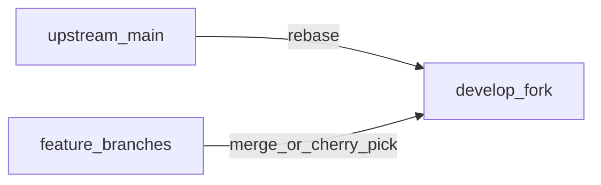

# Fork workflow: upstream, local builds, and optional GitButler

This fork tracks [haseab/retrace](https://github.com/haseab/retrace) while keeping unpublished work on `develop` until you open a PR upstream.

## Remotes

| Remote | URL | Role |
|--------|-----|------|
| `origin` | `https://github.com/aculich/retrace.git` | Your fork (push here) |
| `upstream` | `https://github.com/haseab/retrace.git` | Canonical upstream |

If `upstream` is missing:

```sh
git remote add upstream https://github.com/haseab/retrace.git
```

## Branch roles

- **`develop`** — Your day-to-day branch: latest upstream `main` (via rebase) plus your fork-only commits. Open PRs upstream from here or from short-lived feature branches.
- **`main` (on your fork)** — May lag upstream; that is fine. When you want GitHub’s default branch to match upstream (e.g. for a clean fork surface), fast-forward it intentionally:

  ```sh
  git fetch upstream
  git checkout main
  git reset --hard upstream/main   # destructive to local main only
  git push origin main --force-with-lease
  ```

  Only do this when you do not need unique commits on `origin/main`.

## Tag vs `main`

Release tags (e.g. [v0.8.7](https://github.com/haseab/retrace/releases/tag/v0.8.7)) point at a snapshot commit. **`upstream/main` can be newer than the latest tag.** For “bleeding edge” upstream, always rebase onto `upstream/main`, not onto a tag.

## Daily loop: sync and run

From the repo root (`retrace__haseab/`):

| Command | What it does |
|---------|----------------|
| **`./sync`** | `git fetch upstream`, `checkout develop`, **`git rebase upstream/main`**, then **`./build_and_sign.sh`**. Installs to `/Applications/Retrace.app`. **Does not delete app data or settings.** |
| **`./dev.sh`** | `swift build -c debug` and runs **`.build/debug/Retrace`** with build metadata env vars. Use for fast iteration; not the same as the signed app in `/Applications/`. |
| **`./go`** | Safe by default: quit app, build, install (same idea as a quick reinstall). **`./go --full-reset`** wipes data, preferences, and resets TCC — requires typing `yes` to confirm. |

After `./sync` or `./build_and_sign.sh`:

```sh
open /Applications/Retrace.app
```

## Upstream PRs and other branches

**`./sync` does not merge feature branches into `develop`.** Bring work in explicitly:

```sh
git checkout develop
git merge feature/your-branch    # or: git cherry-pick <sha>
```

To try an open PR from upstream without merging the branch locally:

```sh
git fetch upstream pull/<PR_NUMBER>/head:pr-<PR_NUMBER>
git checkout develop
git merge pr-<PR_NUMBER>           # or cherry-pick specific commits
```

## Verification after integrating upstream

Minimum (from repo root):

```sh
swift build
swift test                       # can be slow; see AGENTS.md for filters
./build_and_sign.sh              # or ./sync for full fork sync + install
```

Smoke: launch the app, confirm capture/search still behave, and check Settings after large merges.

## Data and backups

- Local data layout: [docs/RETRACE_DATA_LAYOUT.md](docs/RETRACE_DATA_LAYOUT.md).
- Small backup (DB + prefs, **excludes** large `chunks/`): `./scripts/backup_retrace_data.sh` (optional: `--include-logs`).
- Do not use **`./go --full-reset`** unless you intend a full wipe.

## GitButler and `but` (optional)

Same constraints as other projects using stacked branches:

1. Install the app + CLI: `brew install --cask gitbutler` (CLI binary: `but`).
2. **Do not mix Graphite (`gt`) and GitButler** stacking in the same worktree; pick one model per repo.
3. Retrace does not require “integration wave” branches unless you choose that complexity; `./sync` + `develop` is enough for most fork workflows.

## Push after rebase

Rebasing rewrites history. After `./sync`, update the remote with:

```sh
git push origin develop --force-with-lease
```

## Diagram


